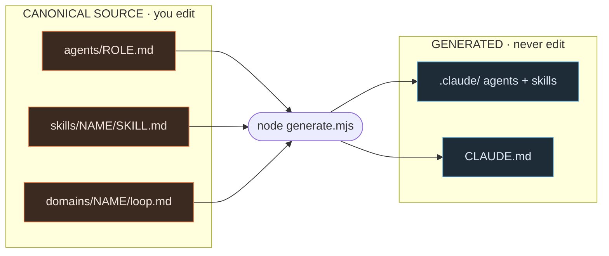
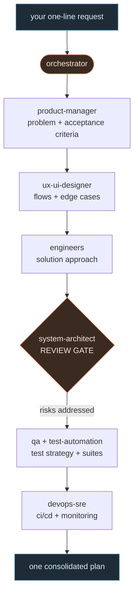
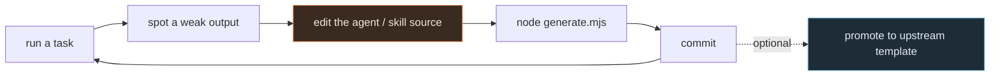
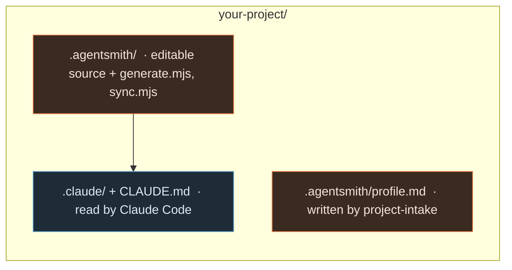

# Working the Swarm — visual operating guide

You don't manage 35 agents one by one. You write each role **once**, forge it into
tool-ready folders, then let one lead agent run the team. This is the whole
operation, with block diagrams. (Diagrams render on GitHub and in any
mermaid-aware viewer.)

## The one idea

There is exactly **one place you edit** (the *canonical source*) and **one command
that builds everything else**. Every folder Claude Code actually reads is
*generated* — treat it like compiled code and never hand-edit it.

Three kinds of things live in the source:

| Layer | Answers | Lives in |
|-------|---------|----------|
| **Agents** — the *who* | which specialist does the work | `agents/<role>.md` |
| **Skills** — the *how* | reusable playbooks shared across agents | `skills/<skill>/SKILL.md` |
| **Domains** — the *team* | who collaborates, in what order | `domains/<domain>/loop.md` |

## Fig. A — How the pieces fit (the forge)

You edit the **source** side. One command — the generator — casts it into the
tool-specific folders.



## The workflow, in five moves

Do steps 1–2 once per project, then live in steps 3–5.

### 1. Get the swarm into a project

Start a fresh repo from the template, or drop the swarm into an existing repo.
The second vendors an editable copy under `.agentsmith/` and builds the tool
folders at the root.

```bash
# fresh repo: click "Use this template" on GitHub, then:
node tools/generate.mjs

# existing repo (run from an AgentSmith checkout):
node tools/init.mjs /path/to/your-project
```

### 2. Personalize it to the project

Run the `project-intake` agent. It interviews you (auto-reading your stack
first), saves a profile, **deletes the roles you don't need**, and tightens the
rest to your stack. Re-run any time the project changes.

> A web project shouldn't carry a firmware engineer. Intake prunes the org chart
> down to your reality.

### 3. Run a team on a task

For anything non-trivial, invoke `orchestrator` with a one-line request. It picks
the domain and runs the collaboration loop below, pausing at the
architecture-review **gate**, and returns one consolidated plan. For a quick
opinion, call a single specialist (e.g. `security-architect`).



### 4. Improve as you go

When an agent's output disappoints, **fix the source, not the one-off reply**:
sharpen its description (when it triggers), its tools (what it can touch), or move
repeated know-how into a skill. Rebuild, commit, repeat — every fix compounds.



### 5. Keep projects in sync

When you improve the shared template, pull those updates into a project with
`sync`. Files you edited locally are never overwritten — the upstream version
arrives beside yours as `<file>.upstream` so you can merge deliberately.

```bash
node .agentsmith/tools/sync.mjs --dry-run   # preview
node .agentsmith/tools/sync.mjs             # apply + rebuild
```

## Fig. E — Where the swarm lives once installed

You touch `.agentsmith/`; the tools read the rest.



## Command cheat sheet

```bash
node tools/generate.mjs          # rebuild .claude/ + CLAUDE.md from source
node tools/init.mjs <path>       # install swarm into another repo
node .agentsmith/tools/sync.mjs  # pull upstream updates (conflict-safe)

# in Claude Code, invoke agents by name:
project-intake      # interview + personalize (run once per project)
orchestrator        # run a full team on a task
security-architect  # or any single specialist for a targeted review
```

## Glossary

| Term | Meaning |
|------|---------|
| **agent** | A single specialist role you can invoke. One file, one job. |
| **skill** | A reusable playbook (the "how") shared across agents. |
| **domain** | A team of agents + the order they collaborate in. |
| **orchestrator** | The lead agent that runs a whole team for you. |
| **project-intake** | The agent that interviews you and tailors the swarm to one project. |
| **canonical** | The single source you edit: `agents/`, `skills/`, `domains/`. |
| **generated** | Built output Claude Code reads: `.claude/`, `CLAUDE.md`. Never hand-edit. |
| **init / sync** | Install the swarm into a repo / pull later updates without losing local edits. |

---

*Prefer the styled version? Open [`swarm-guide.html`](swarm-guide.html) in a
browser — same content, richer layout (diagrams need internet, via mermaid CDN).
This Markdown copy is the fully portable one: it renders anywhere, including on
GitHub and offline.*
